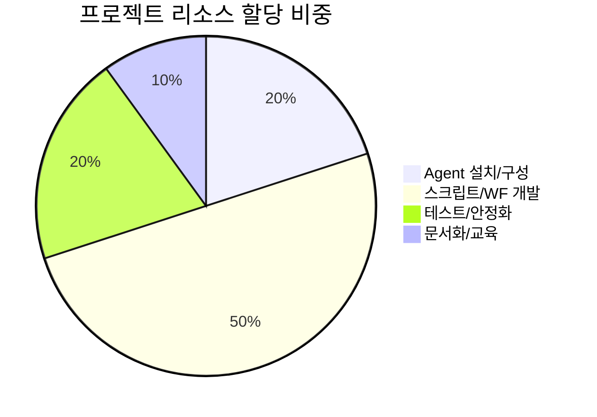

# 📅 MDRM 구축 프로젝트 일정 관리

!!! info "문서 개요"
    이 문서는 재해복구시스템(MDRM) 구축 프로젝트의 전체 일정을 시각화하고, 각 단계별 주요 과업을 효율적으로 관리하기 위한 가이드입니다. 
    사용자가 제공한 일정표를 기반으로 **Mermaid Gantt Chart**와 **Kanban Board**를 구성하였습니다.

---

## **1. 프로젝트 전체 일정 (Gantt Chart)**

프로젝트는 크게 **분석 → 설계 → 구축 → 검증 → 완료**의 5단계로 진행되며, 각 단계별 마일스톤(모의훈련 등)을 포함합니다.

<iframe src="../../../assets/diagrams/project_schedule.html" width="100%" height="600px" style="border:none;"></iframe>

---

## **3. 주요 물량 및 공수 산정**

프로젝트 수행에 필요한 주요 자원과 예상 소요 시간입니다.

### **3.1 Agent 설치**
*   **총 수량**: 350 EA
*   **일일 처리량**: 50 EA
*   **예상 소요**: 7 Man-Days

### **3.2 Workflow 구성**
*   **총 수량**: 800 Step
*   **일일 처리량**: 30 Step
*   **예상 소요**: 27 Man-Days

