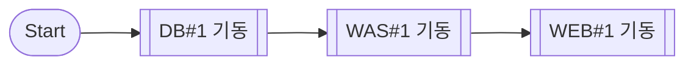

# 📂 그룹 워크플로우

!!! info "학습 안내"
    단위 업무(서비스) 구성을 위해 여러 시스템 워크플로우를 조합하고 실행 순서와 의존성을 정의하는 방법을 학습합니다.

---

## **1. 개요 및 특징**

그룹 워크플로우는 **비즈니스 서비스(업무) 단위의 실행 단위**입니다. 서로 다른 서버에서 실행되는 여러 시스템 워크플로우를 하나의 흐름으로 묶어 관리합니다.

*   **핵심 기능**: **워크플로우 링크** (기존에 만들어둔 시스템 워크플로우를 불러와서 연결)
*   **실행 제어**: 업무 간의 상관관계에 따라 **순차(Sequential)** 또는 **병렬(Parallel)** 실행을 설정합니다.
*   **특징**: 개별 서버의 작업 성공 여부에 따라 다음 단계 진행 여부를 결정하거나 인자를 전달할 수 있습니다.

---

## **2. 주요 실무 유형**

### **2.1 업무 기동**
서비스 구동을 위한 표준 절차를 정의합니다.
*   **일반적 순서**: [DB 기동] → [WAS 기동] → [WEB 기동]

### **2.2 업무 종료**
시스템 점검이나 센터 전환 시 서비스를 안전하게 종료합니다.
*   **일반적 순서**: [WEB 종료] → [WAS 종료] → [DB 종료] (기동의 역순)

### **2.3 업무 전환**
주센터 점검 시 재해복구센터로 서비스를 넘기는 절차입니다.
*   **절차**: [주센터 종료] → [데이터 Sync 확인] → [DR센터 기동]

---

## **3. 작성 예시 (카드서비스 업무 기동)**

하나의 업무 그룹 내에서 WEB/WAS/DB 워크플로우를 연동한 예시입니다.

---

## **4. 워크플로우 링크 활용**

그룹 워크플로우를 효율적으로 작성하려면 **'Workflow Link'** 컴포넌트를 적극 활용해야 합니다.

1.  **재사용성**: 동일한 DB 기동 워크플로우를 여러 업무 그룹에서 참조할 수 있습니다.
2.  **가독성**: 복잡한 스크립트 대신 이미 완성된 워크플로우 명칭만 보이므로 전체 흐름 파악이 쉽습니다.
3.  **유지보수**: 시스템 워크플로우 하나만 수정하면 이를 참조하는 모든 그룹 워크플로우에 자동 반영됩니다.

---

<a href="../MDRM_워크플로우_시나리오/" class="next-step-card">
    
        Next Step
        🎬 전사 시나리오 워크플로우 가이드
    
    →
</a>

