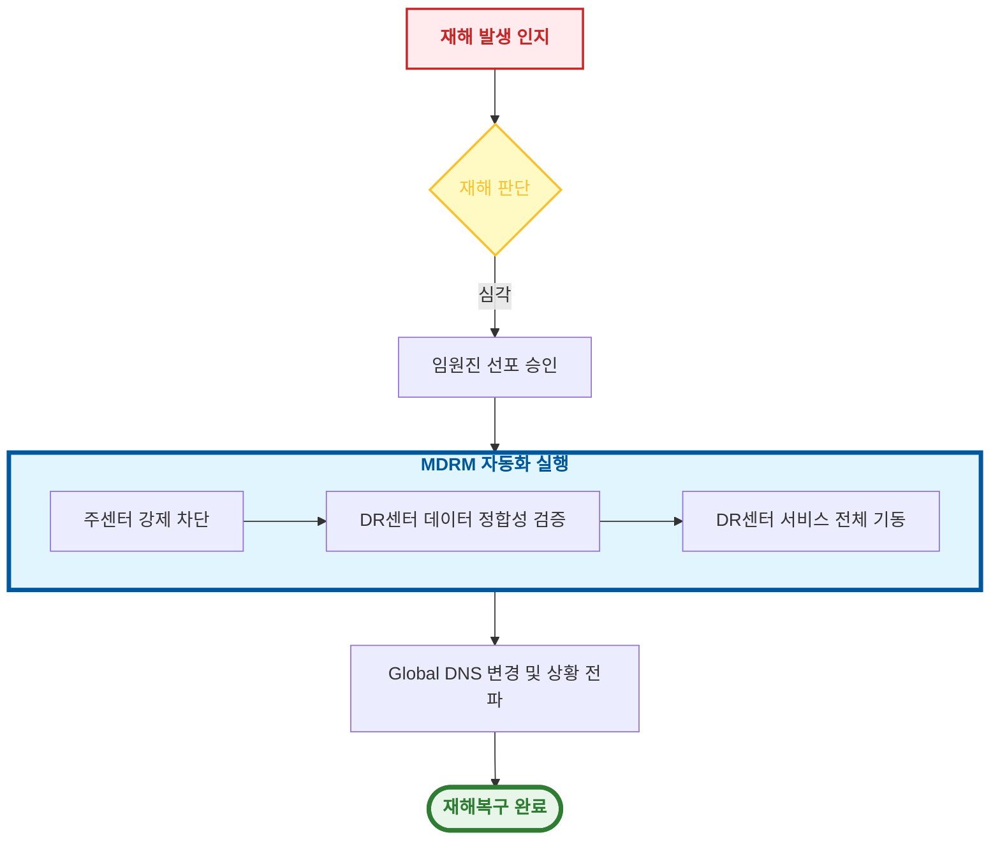

# 🎬 시나리오 워크플로우

!!! info "학습 안내"
    MDRM의 최상위 실행 단위인 시나리오 워크플로우를 실무에 적용합니다. **운영 자동화(일상 작업)**와 **재해복구 자동화(비상 상황)**라는 두 가지 핵심 축을 중심으로 구성 원칙을 학습합니다.

---

## **1. 개요**

시나리오 워크플로우는 **경영진의 의사결정**이나 **정기적인 운영 스케줄**을 실행으로 옮기는 최상위 프로세스입니다. 전사 센터를 대상으로 운영 자동화(IPL, 배치) 및 재해복구(모의훈련, 실제 선포) 시나리오를 통합하여 제어하는 역할을 수행합니다.

---

## **2. 시나리오 주요 유형**

시나리오 워크플로우는 크게 **운영 자동화**와 **재해복구 자동화**로 구분하여 구축합니다.

### **2.1 운영 자동화**
수작업이 많고 복잡한 일상적인 인프라/애플리케이션 운영 작업을 자동화합니다.

*   **정기 기동/종료 (IPL)**: 수십 대의 서버를 정해진 순서와 의존성에 따라 일괄 기동하거나 종료합니다.
*   **배치 처리**: 여러 시스템에 걸친 대규모 배치 작업을 통합 제어하고 로그를 관리합니다.
*   **정기 점검**: 인프라 정기 점검 시 필요한 서비스 정지 및 기동 시나리오를 자동화합니다.

### **2.2 재해복구 자동화**
재해 발생 시 서비스 연속성을 보장하기 위한 핵심 시나리오입니다.

*   **재해 선포**: 주센터 중단 확인 후 DR센터로 서비스를 즉시 전환합니다.
*   **업무 복귀**: 주센터 복구 완료 후 DR센터의 데이터를 역복제하고 서비스를 메인 센터로 환원합니다.
*   **모의 훈련**: 실제 서비스 영향 없이 DR 시스템의 기동 가능 여부와 정합성을 주기적으로 검점합니다.

---

## **3. 작성 예시 (전체 재해 선포)**

실제 재해가 선포되었을 때, 단순 기동을 넘어 의사결정 절차가 결합된 프로세스 예시입니다.

1.  **재해 판단**: 시스템 장애 수준을 파악하여 재해 여부를 결정합니다.
2.  **임원진 승인**: 서비스 전환에 따른 리스크를 검토하고 최종 실행을 승인합니다.
3.  **데이터 정합성 검증**: 복제된 데이터가 동기화된 시점을 확인하여 데이터 손실(RPO)을 최소화합니다.
4.  **상황 전파**: 서비스 전환 완료 후 유관 부서 및 고객에게 공지합니다.

---

<a href="../MDRM_컴포넌트_설계_로직/" class="next-step-card">
    
        Next Step
        🧩 핵심 컴포넌트 설계 로직
    
    →
</a>

