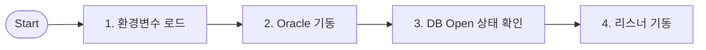

# 💻 시스템 워크플로우

!!! info "학습 안내"
    개별 서버(Node) 단위의 가장 기초적인 작업을 정의하는 방법과 표준 생성 패턴을 학습합니다.

---

## **1. 개요 및 특징**

시스템 워크플로우는 **단일 서버 내에서 실행되는 실행 프로세스의 집합**입니다. Agent가 설치된 서버에서 직접 스크립트나 명령어를 수행합니다.

*   **실행 주체**: 각 서버에 설치된 Agent
*   **주요 용도**: 프로세스 기동/종료/점검, 파일 처리, SQL 수행 등
*   **생성 원칙**: 하나의 워크플로우는 **'하나의 목적'**을 명확히 가져야 합니다. (예: 기동용, 종료용 분리 권장)

---

## **2. 주요 생성 항목**

서버별로 최소한 다음 3가지 유형의 워크플로우를 세트로 구성하는 것이 표준입니다.

### **2.1 서비스 기동**
애플리케이션이나 DB 서비스를 시작하는 절차입니다.

*   **포함된 컴포넌트**: `Process Start` (프로세스 실행), `Wait` (대기)
*   **작성 팁**: 실행 명령어 뒤에 `&`를 붙여 백그라운드로 실행하거나, `nohup`을 사용하는 것이 일반적입니다.

### **2.2 서비스 종료**
실행 중인 서비스를 안전하게 종료(Graceful Shutdown)하는 절차입니다.

*   **포함된 컴포넌트**: `Process Stop` (프로세스 종료), `Kill Process` (강제 종료)
*   **작성 팁**: `kill -15` (SIGTERM)를 우선 시도하고, 일정 시간 후에도 종료되지 않으면 `kill -9` (SIGKILL)를 수행하도록 분기 처리합니다.

### **2.3 서비스 점검**
현재 서비스가 정상적으로 동작 중인지 검증하는 절차입니다.

*   **포함된 컴포넌트**: `Check Port` (포트 확인), `Grep Process` (프로세스 확인)
*   **작성 팁**: 단순히 프로세스 유무만 확인하기보다, 실제 서비스 포트(Listen Port)가 열려있는지 확인하는 것이 더 정확합니다.

---

## **3. 작성 예시 (Oracle Database 기동)**

---

<a href="../MDRM_워크플로우_그룹/" class="next-step-card">
    
        Next Step
        📂 업무 그룹 워크플로우 가이드
    
    →
</a>

