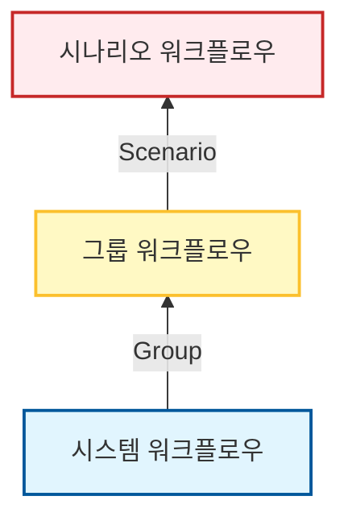

# 🔄 MDRM 워크플로우 유형 및 구조

!!! info "학습 안내"
    MDRM의 워크플로우는 **시스템(서버)** 단위부터 **그룹(업무)**, **시나리오(재해)** 단위까지 계층적으로 구성됩니다. 각 유형별 특징과 활용 방안을 학습합니다.

---

## **1. 워크플로우 계층 구조**

MDRM은 효율적인 관리와 재사용성을 위해 워크플로우를 3단계 계층으로 구분합니다. 하위 워크플로우를 상위 워크플로우가 포함(Link)하는 구조입니다.

---

## **2. 유형별 상세 정의**

### **2.1 시스템 워크플로우**
가장 기본이 되는 실행 단위로, **개별 서버(System)** 내에서 수행되는 작업을 정의합니다.

*   **주요 역할**: 특정 서버의 프로세스(서비스) 기동, 종료, 상태 점검 등
*   **구성 요소**: 쉘 스크립트, 파일 전송, SQL 실행 등 단일 서버 작업
*   **활용 예시**:
    *   `WEB-01` 서버의 Apache 기동
    *   `DB-01` 서버의 Oracle 리스너 종료

!!! check "필수 생성 항목"
    *   **서비스 기동**: 프로세스 및 애플리케이션 시작
    *   **서비스 종료**: 프로세스 정상 종료
    *   **서비스 점검**: 포트(Port) 또는 프로세스(PID) 정상 확인

### **2.2 그룹 워크플로우**
여러 개의 시스템 워크플로우를 묶어 **업무(서비스)** 단위로 그룹화한 워크플로우입니다.

*   **주요 역할**: 시스템 워크플로우 간의 연결 및 의존성 관리 (순차/병렬 실행)
*   **특징**: **워크플로우 링크** 기능을 통해 하위 워크플로우를 호출합니다.
*   **활용 예시**:
    *   **계정계 시스템**: [WEB 기동] → [WAS 기동] → [DB 연결 확인]
    *   **채널계 시스템**: [인터페이스 서버 종료] → [채널 서비스 종료]

!!! check "필수 생성 항목"
    *   **업무 기동**: (WEB → WAS → DB 순서 등 의존성 고려)
    *   **업무 종료**: (역순 종료: DB → WAS → WEB)
    *   **업무 전환**: (운영센터 종료 + 재해복구센터 기동 + DNS 변경)

### **2.3 시나리오 워크플로우**
전체 운영 체계 또는 재해복구 전략에 맞춰 그룹 워크플로우들을 통합한 최상위 워크플로우입니다. 크게 **운영 자동화**와 **재해복구 자동화**로 구분됩니다.

*   **주요 역할**: 전사적 운영 관리 및 대단위 업무의 실행 시나리오 정의
*   **활용 예시**:
    *   **운영 자동화**: [전체 서버 IPL (기동/종료)] + [일괄 배치 작업 제어]
    *   **재해복구**: [계정계 전환] + [정보계 전환] + [대외계 전환]
    *   **모의 훈련**: [비상 연락망 기동] + [DNS 변경] + [핵심 서비스 기동]

!!! check "필수 생성 항목"
    *   **운영 시나리오**: 정기 기동/종료(IPL), 대규모 배치 로직 등
    *   **재해 선포**: 전체 인프라 동시 기동/전환
    *   **원복**: 메인 센터 정상화 후 서비스 복귀
    *   **비상 훈련**: 실제 데이터 변경 없이 기동 여부만 검증 (Dry Run)

---

## **3. 요약**

| 구분 | 단위 | 대상 | 비고 |
| :--- | :--- | :--- | :--- |
| **시스템 워크플로우** | Server | 개별 단위 작업 | 프로세스/스크립트 실행 |
| **그룹 워크플로우** | Service | 업무/서비스 그룹 | 시스템 워크플로우의 집합 |
| **시나리오 워크플로우** | DR/Event | 전체 훈련/시나리오 | 최상위 실행 시나리오 |

---

<a href="../MDRM_워크플로우_시스템/" class="next-step-card">
    
        Next Step
        💻 시스템 워크플로우
    
    →
</a>

