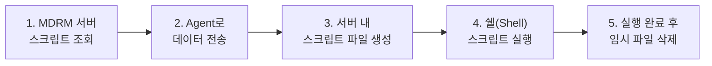

# ⚡ 컴포넌트 실행 프로세스

!!! info "스크립트 실행 메커니즘"
    MDRM 서버에서 정의된 컴포넌트 스크립트가 실제 관리 대상 서버(Agent)로 전송되어 실행되는 전체 과정을 설명합니다.

## **1. 실행 흐름도**

컴포넌트 실행 명령이 내려지면 다음의 5단계 프로세스를 거쳐 자동화 작업이 수행됩니다.

---

## **2. 단계별 상세 설명**

### **① 스크립트 조회 및 전송**
*   MDRM 서버 DB에 저장된 컴포넌트 템플릿 코드와 사용자가 입력한 인자값(Arguments)을 조합합니다.
*   조합된 데이터를 데이터센터 엔진을 통해 해당 서버의 Agent로 암호화하여 전송합니다.

### **② 임시 파일 생성**
*   Agent는 수신한 스크립트 데이터를 서버의 임시 디렉토리에 실행 가능한 형태의 파일(`.sh` 등)로 생성합니다.

### **③ 스크립트 실행**
*   생성된 파일을 OS 쉘을 통해 실행합니다. 이때 실시간으로 발생하는 표준 출력(stdout)과 에러 출력(stderr)은 다시 MDRM 서버로 전송되어 관리 콘솔에서 실시간으로 확인할 수 있습니다.

### **④ 사후 정리 (Cleanup)**
*   스크립트 실행이 종료되면 보안 및 자원 관리를 위해 생성했던 임시 스크립트 파일을 즉시 삭제합니다.

---

<a href="../MDRM_컴포넌트_템플릿_제작/" class="next-step-card">
    
        Next Step
        컴포넌트 템플릿 제작 가이드
    
    →
</a>

