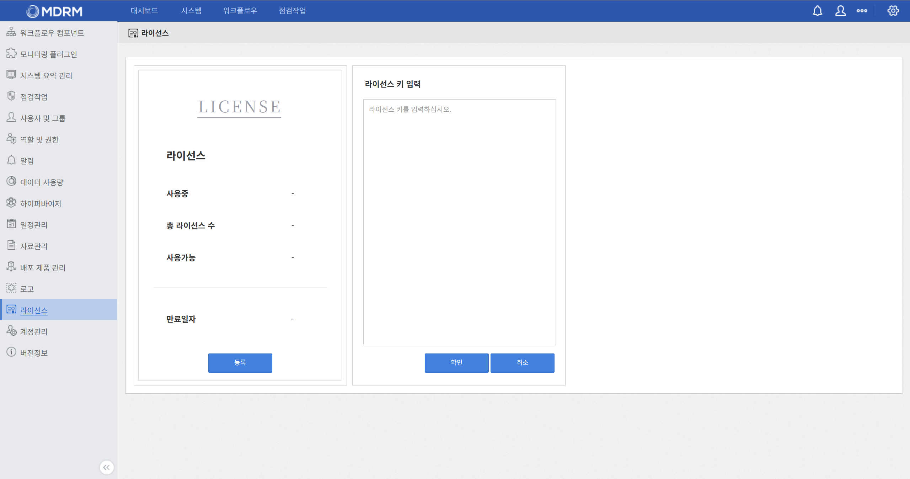

# 🔑 임시 라이선스 입력

!!! info "학습 안내"
    MDRM 설치 직후, 원활한 실습 진행을 위해 시스템에 부여된 실습용 임시 라이선스를 등록하는 과정입니다.

## **1. 라이선스 등록 절차**

교육생은 발급된 임시 라이선스 코드를 통해 메인 메뉴 권한을 활성화해야 합니다. 아래 등록 절차(1~3단계)를 참고하여 코드를 붙여넣어 주십시오.

<div class="custom-carousel">
  <div class="carousel-slide active">
    <div class="carousel-caption">1단계: 우측 상단의 ⚙️ [설정] &gt; [라이선스] 메뉴로 이동합니다.</div>
    
  </div>
  <div class="carousel-slide">
    <div class="carousel-caption">2단계: 우측 화면에서 '등록' 버튼을 눌러 입력 창을 활성화합니다.</div>
    
  </div>
  <div class="carousel-slide">
    <div class="carousel-caption">3단계: 아래의 발급받은 교육용 라이선스 코드를 붙여넣고 저장합니다.</div>
    
  </div>
  
  <a class="carousel-prev" onclick="window.moveSlide(-1, this)">&#10094;</a>
  <a class="carousel-next" onclick="window.moveSlide(1, this)">&#10095;</a>
</div>

!!! info "교육용 임시 라이선스 키 복사"
    아래의 코드 블록 전체를 복사(`Ctrl + C` 또는 우측 상단의 📋 버튼 클릭)하여 붙여넣고 저장해주십시오.

```text title="MDRM 교육용 임시 라이선스"
HOST localhost ANY 5053
ISV mantech port=5055
LICENSE mantech mdrm 4 11-may-2026 30 min_timeout=60 _ck=91083287a6
sig="c2N252zwy6w4ZPHI9iLtaUuUuFg3aByQ0igy=Fp4MrJjVp7i0QZfcTRF5ykoBN
"
```

!!! tip "주의사항"
    `sig=` 항목 마지막의 들여쓰기된 큰따옴표(`"`) 기호까지 전부 누락 없이 복사되어야 라이선스가 정상적으로 인식됩니다. 등록을 마치면 메인 메뉴가 정상적으로 활성화됩니다!

---

## **2. 라이선스 파일 직접 수정 (대체 방법)**

웹 콘솔(GUI) 상에서 등록 버튼이 활성화되지 않거나 콘솔에 접속할 수 없는 경우, 서버 내부에 위치한 라이선스 파일을 직접 편집하여 적용할 수 있습니다.

**1.** MDRM 관리 서버에 접속한 후, 라이선스 파일(`ent.lic`)을 문서 편집기(`vi` 등)로 엽니다.
```bash
vi /mdrm/data/license/ent.lic
```

**2.** 파일 내 기존 내용을 전부 지운 뒤, 발급받은 **임시 라이선스 키**를 붙여넣고 저장(`:wq`)합니다.

**3.** 변경된 라이선스 파일을 시스템에 인식시키기 위해 전체 컴포넌트를 재기동합니다.
```bash
# Docker Compose 디렉토리로 이동
cd /mdrm/data/bin

# 전체 시스템(MDRM) 재기동
docker compose down
docker compose up -d
```

---

<center>
    <p style="opacity: 0.5; font-size: 0.8rem;">
        이것으로 <strong>MDRM 설치 및 운영</strong> 파트의 교육 단계를 마칩니다. 수고하셨습니다!
    </p>
</center>

---

<div class="next-step-card-container" markdown>
<a href="../../part2/MDRM_PART2_학습_안내/" class="next-step-card">
    <span class="next-content">
        <span class="next-step-label">Next Step</span>
        <span class="next-step-title">📋 PART 2: 운영 환경 구성 및 자원 관리</span>
    </span>
    <span class="next-step-icon">→</span>
</a>
</div>
