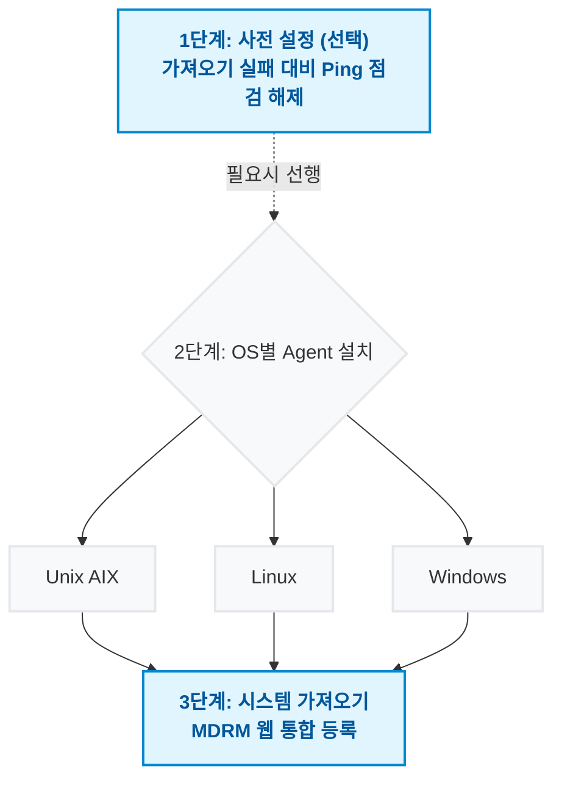

# Agent 설치 및 등록

!!! info "학습 안내"
    MDRM Agent를 대상 서버에 설치하고 시스템 전반에서 관리할 수 있도록 등록하는 다양한 방법들과 환경별 최적의 선택 가이드를 학습합니다.

---

## **1. 설치 방법 개요**

| 방식 | 특징 및 적합한 환경 |
| :--- | :--- |
| **자동설치** | MDRM 서버를 통한 일괄 배포. **테스트 및 교육/PoC 환경에서 활용을 권장합니다.** (SSH root 접속 허용 필수) |
| **수동설치** | 서버에 직접 설치. 망 분리 및 엄격한 보안 정책(포트 제한 등)으로 인해 **대부분의 실제 프로젝트 구축 환경에서는 수동설치가 표준으로 사용됩니다.** |
| **시스템 수동등록** | **스토리지 복제/DR 환경 전용**. OS 이미지가 그대로 전송되는 특수 환경 (NodeID 매핑) |
| **Agentless** | Agent 설치 불가 장비(스토리지, 네트워크 등) 관리용. SSH/WinRM 연동 |

!!! danger "Agent 실행 환경 관련 중요 고지"
    Agent의 안정적인 기동과 정상 작동을 위해 아래의 Java 환경 요구사항을 반드시 확인하시기 바랍니다.

    *   **OS별 JRE 배포 방식**:
        *   **Linux / Windows**: 설치 패키지에 **JRE(Java 8)가 기본 포함**되어 함께 배포됩니다.
        *   **AIX**: JRE가 포함되지 않으므로, 설치 전 **Java 버전 확인 및 `JAVA_HOME` 설정이 필수**입니다.
    *   **AIX 전용 설치 규칙 (Legacy 대응)**:
        *   시스템의 Java 버전이 **1.8 미만**일 경우, Agent를 최신 버전이 아닌 **1.2.10 버전으로 설치**해야 합니다.
        *   **제약 사항**: 1.2.10 버전 설치 시, MDRM 관리 콘솔에서의 **실시간 로그 출력(Streaming) 기능을 지원하지 않습니다.**
    *   **표준 지원 범위**: 최신 Agent(1.3.0 이상)는 **Java 8부터 Java 11까지**의 환경에서 최적의 성능을 보장하며, 실시간 로그 모니터링을 지원합니다.

## **2. 설치 방법 선택 가이드**

### 방법 1: 자동설치

| 항목 | 내용 |
|:---|:---|
| **설명** | MDRM 서버를 통해 자동으로 Agent를 설치하는 가장 간편한 방법 |
| **난이도** | ⭐ (가장 쉬움) |
| **권장도** | ⭐⭐⭐ (강력 권장) |
| **요구사항** | SSH root 계정 접속 가능 / MDRM 서버와 네트워크 연결 가능 |
| **적합한 환경** | 일반적인 서버 환경 / 다수의 서버에 빠르게 설치 |
| **상세 가이드** | [자동설치 가이드 →](MDRM_Agent_자동설치.md) |

---

### 방법 2: 수동설치 후 가져오기

| 항목 | 내용 |
|:---|:---|
| **설명** | SSH root 접속이 불가능할 때 사용하는 방법 |
| **난이도** | ⭐⭐ |
| **권장도** | ⭐⭐ |
| **요구사항** | 서버 직접 접근 가능 / 수동 설치 파일 전송 가능 |
| **적합한 환경** | SSH root 접속 제한 환경 / 네트워크 분리 환경 / DMZ 구간 서버 |

#### **수동설치 진행 절차**

수동설치는 자동설치와 달리 3단계의 흐름으로 진행됩니다. 다음 순서대로 작업을 수행하시기 바랍니다.

*   **[1단계: 가져오기 사전점검 (Ping) 해제](../troubleshooting/MDRM_TS_시스템_가져오기_실패.md)** *(방화벽 등으로 인해 통신 점검 실패 시)*
*   **2단계: OS 플랫폼별 패키지 수동 설치**
    *   [수동설치 - 유닉스(AIX) 매뉴얼](MDRM_Agent_수동설치_AIX.md)
    *   [수동설치 - 리눅스(Linux) 매뉴얼](MDRM_Agent_수동설치_리눅스.md)
    *   [수동설치 - 윈도우(Windows) 매뉴얼](MDRM_Agent_수동설치_윈도우.md)
*   **[3단계: MDRM으로 에이전트 가져오기(Import)](MDRM_Agent_수동설치_가져오기.md)**

---

### 방법 3: 시스템 수동등록

| 항목 | 내용 |
|:---|:---|
| **설명** | Storage 복제로 OS 이미지가 그대로 복사되는 특수한 환경에서 사용 |
| **난이도** | ⭐⭐⭐ (가장 복잡) |
| **권장도** | ⭐ (특수 상황 전용) |
| **요구사항** | NodeID 매핑 작업 필요 / 백업센터와 운영센터 분리 환경 |
| **적합한 환경** | Storage 복제 환경 / 백업센터 ↔ 운영센터 분리 / OS 이미지 전체 복사 |
| **주의사항** | ⚠️ **매우 특수한 상황에서만 사용** |
| **상세 가이드** | [시스템 수동등록 가이드 →](MDRM_Agent_시스템수동등록.md) |

---

### 방법 4: Agentless 설정

| 항목 | 내용 |
|:---|:---|
| **설명** | Agent를 설치하지 않고 SSH/WinRM으로 시스템을 관리하는 방법 |
| **난이도** | ⭐⭐ |
| **권장도** | ⭐ (제약 많음) |
| **요구사항** | SSH 또는 WinRM 접속 가능 / 계정 정보 관리 필요 |
| **적합한 환경** | Agent 설치 불가 환경 / 임시 관리 필요 / 네트워크 장비 등 |
| **제약사항** | ❌ 실시간 모니터링 제한 / ❌ 일부 기능 사용 불가 |
| **상세 가이드** | [Agentless 설정 가이드 →](MDRM_Agent_Agentless.md) |

---

## **3. 설치 방법 비교표**

| 구분 | 자동설치 | 수동설치 | 시스템 수동등록 | Agentless |
|:---:|:---:|:---:|:---:|:---:|
| **난이도** | ⭐ | ⭐⭐ | ⭐⭐⭐ | ⭐⭐ |
| **권장도** | ⭐⭐⭐ | ⭐⭐⭐ | ⭐ | ⭐ |
| **설치 시간** | 5분 | 15분 | 30분+ | 10분 |
| **SSH root 필요** | ✅ | ❌ | ❌ | ❌ |
| **Agent 설치** | ✅ | ✅ | ✅ | ❌ |
| **실시간 모니터링** | ✅ | ✅ | ✅ | ❌ |
| **자동 등록** | ✅ | ❌ | ❌ | ❌ |
| **복잡도** | 낮음 | 중간 | 높음 | 중간 |
| **유지보수** | 쉬움 | 보통 | 어려움 | 어려움 |

---

<a href="../MDRM_Agent_자동설치/" class="next-step-card">
    
        Recommended
        🚀 Agent 자동 설치 가이드
    
    →
</a>

